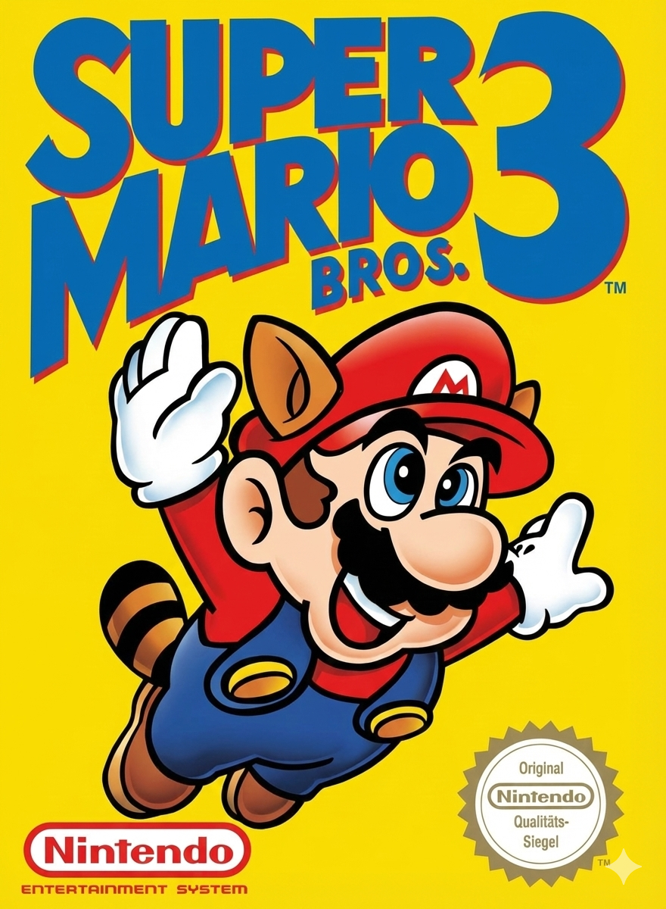
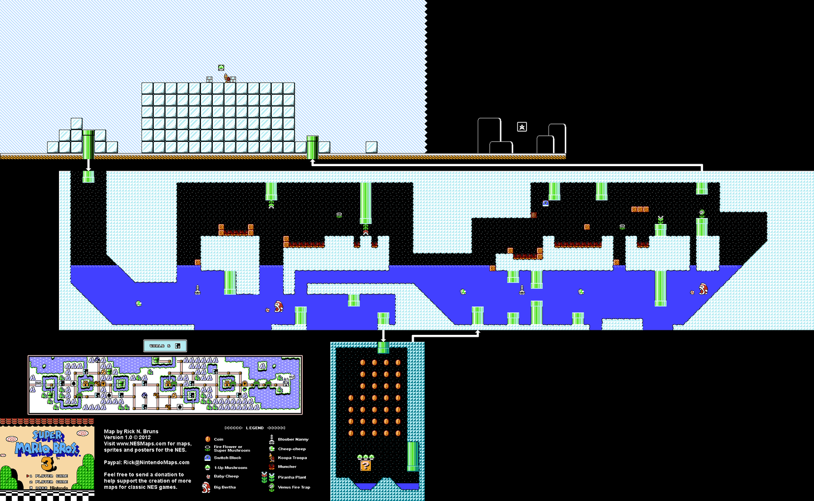

<div align="center">

  

  # Super Mario World 6-9

  
  
  

  <br>

  **A recreation of the famous World 6-9 level using [C++](https://isocpp.org/) and the [Qt Framework](https://www.qt.io/).**

</div>

---

## 📝 About The Project

This project is a faithful reproduction of the **World 6-9** level from the Super Mario universe. The goal was to build a platformer game engine from scratch using **C++** and **Qt**, handling physics, collisions, and enemy AI.

---

## 🗺️ Level Map

Here is the complete layout of the level we recreated. The game features underwater mechanics, pipes, and complex collisions just like the original.



---

## 🚀 How to Run

1.  Clone the repository:
    ```bash
    git clone [https://github.com/tuo-username/super-mario-world-6-9.git](https://github.com/tuo-username/super-mario-world-6-9.git)
    ```
2.  Open `SuperMario.pro` (or CMakeLists.txt) in **Qt Creator**.
3.  Configure the project with your standard Qt kit.
4.  Build and Run.

---

## <a name="contributors">👥 Contributors</a>

| Name              |  GitHub                                               |
|-------------------|-------------------------------------------------------|
| Giuseppe Alfieri  | [@giusalfieri](https://github.com/giusalfieri)        |
| Nico Fiorini      | [@capocattiveria](https://github.com/capocattiveria)  |
| Jacopo Saccocci   |                                                       |
